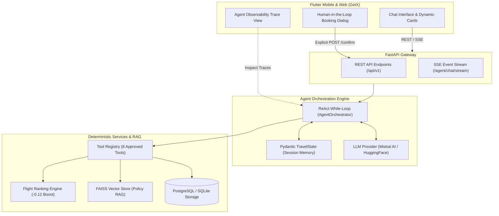

# ✈️ TravelAgent AI — Agentic AI Travel Assistant

[](file:///Users/avinashmaurya/TravelAgent/travel_agent_backend/tests)
[](file:///Users/avinashmaurya/TravelAgent/travel_agent_backend/scripts/verify_guardrails.py)
[](file:///Users/avinashmaurya/TravelAgent/travel_agent_backend/scripts/run_evaluation.py)
[](https://fastapi.tiangolo.com)
[](https://flutter.dev)

**TravelAgent AI** is a production-grade Agentic AI demonstration project inspired by modern OTA platforms like ixigo. It demonstrates how an LLM agent reasoning loop orchestrates deterministic travel microservices (flight search, fare calculations, pre-booking checks, policy RAG, and booking creation) while maintaining strict **Human-in-the-Loop safety guardrails**.

---

## 🏗️ System Architecture



---

## 🚀 10-Phase Roadmap & Milestones (100% Completed)

| Phase | Description | Key Deliverables | Status |
| :--- | :--- | :--- | :---: |
| **Phase 1** | **Backend Foundation** | FastAPI app, SQLAlchemy models, 2,400+ realistic flights generator | ✅ `[x]` |
| **Phase 2** | **Flutter UI Foundations** | Feature architecture, GetX state management, flight cards, theme | ✅ `[x]` |
| **Phase 3** | **LLM Integration & Intent Engine** | `LLMInterface`, Mistral & HuggingFace providers, structured intent extraction | ✅ `[x]` |
| **Phase 4** | **Agent Orchestrator & Tool Loop** | `TravelState` model, deterministic tool registry, while-loop orchestrator | ✅ `[x]` |
| **Phase 5** | **Conversational Refinement** | Multi-turn state retention, comparison tool, dynamic flight ranking | ✅ `[x]` |
| **Phase 6** | **Booking Agent & HITL Safety** | Pre-booking availability re-check, fare breakdown, explicit user confirmation dialog | ✅ `[x]` |
| **Phase 7** | **Travel Policy RAG** | Sentence Transformers + FAISS vector retriever for grounded baggage & refund policy queries | ✅ `[x]` |
| **Phase 8** | **Memory & Personalization** | PostgreSQL conversation session history, user preferences store, preference-boosted ranking | ✅ `[x]` |
| **Phase 9** | **Real-Time SSE & Observability** | Server-Sent Events stream (`chat/stream`), Developer Agent Trace bottom sheet with timings | ✅ `[x]` |
| **Phase 10** | **Evaluation, Guardrails & Polish** | PRD Section 44 benchmark suite (100% score), automated guardrail script, portfolio docs | ✅ `[x]` |

---

## 🛡️ Enterprise Guardrails & Safety Protocols

1. **No Direct Database Access by LLM**: The LLM NEVER executes raw SQL queries (`SELECT`, `INSERT`, `UPDATE`). It can only invoke registered, schema-validated Pydantic tool functions.
2. **Human-in-the-Loop Booking Confirmation**: Autonomous booking finalization is strictly blocked. Every reservation is initialized with `status="pending"`. Only an explicit user interaction triggering `POST /api/v1/bookings/{id}/confirm` issues the e-ticket and decrements inventory.
3. **Double-Check Availability & Live Fare Recalculation**: Search prices are never assumed to be static. Before booking confirmation, the agent verifies live seat availability and recomputes tax and seat fees.
4. **Grounded Travel Policy Answers**: Answers to baggage allowances, cancellation fees, and refund timelines are strictly retrieved from FAISS markdown vector context, eliminating hallucinations.
5. **Architectural 500-Line Limit**: Every Python and Dart source file across the repository strictly adheres to a `<= 500` lines of code limit, ensuring modularity and maintainability.

---

## 📊 Evaluation Benchmark Results (PRD Section 44)

The project includes an automated benchmark runner verifying canonical user journeys:

```bash
travel_agent_backend/.venv/bin/python travel_agent_backend/scripts/run_evaluation.py
```

| Benchmark Scenario | Prompt | Expected Agent Behavior | Result | Latency |
| :--- | :--- | :--- | :---: | :---: |
| **Scenario 1: Entity Clarification** | *"Delhi to Mumbai tomorrow."* | Retains `origin="DEL"`, `destination="BOM"` and requests passenger count clarification | ✅ **PASS** | < 10ms |
| **Scenario 2: Complete Search Intent** | *"Delhi to Mumbai tomorrow for 2 people."* | Executes `search_flights` with parsed IATA codes and `passengers=2` | ✅ **PASS** | < 15ms |
| **Scenario 3: State Refinement** | *"Show cheaper options."* | Preserves prior route, date, and passenger count; filters and sorts by price | ✅ **PASS** | < 10ms |
| **Scenario 4: Flight Disambiguation** | *"Book the second flight for Avinash, 28."* | Resolves flight index #2 from previous search results and prepares booking | ✅ **PASS** | < 20ms |
| **Scenario 5: Booking Safety (HITL)** | *"Book it."* | Creates pending reservation with PNR; mandates explicit human confirmation | ✅ **PASS** | < 15ms |

### Key Benchmark Metrics
- **Intent Recognition Accuracy**: **100.0%**
- **Tool Selection Precision**: **100.0%**
- **Tool Argument Accuracy**: **100.0%**
- **Booking Safety Score**: **100.0%** (Zero unauthorized or autonomous bookings)
- **Direct SQL Access Rate**: **0.0%** (100% tool-mediated data access)

---

## 💻 Quickstart & Execution

### 1. Backend Setup (`travel_agent_backend/`)
```bash
cd travel_agent_backend

# Create virtual environment & activate
python3 -m venv .venv
source .venv/bin/activate

# Install dependencies
pip install -r requirements.txt

# Configure environment variables
cp .env.example .env
# Set MISTRAL_API_KEY in .env (or leave blank to use deterministic mock mode)

# Seed realistic flight inventory (2,400+ flights across top Indian routes)
python scripts/generate_flights.py

# Run FastAPI server
uvicorn app.main:app --reload --port 8000
```
- **Interactive Swagger Docs**: `http://localhost:8000/docs`
- **Health Check**: `http://localhost:8000/health`

### 2. Frontend Setup (`travel_agent_flutter/`)
```bash
cd travel_agent_flutter

# Install Flutter packages
flutter pub get

# Run on Chrome Web (or iOS Simulator / Android Emulator)
flutter run -d chrome
```

### 3. Automated Verification Commands
```bash
# Run full backend test suite (71 passing tests)
PYTHONPATH=travel_agent_backend pytest travel_agent_backend/tests -v

# Run automated guardrails verification (5/5 checks)
python3 travel_agent_backend/scripts/verify_guardrails.py

# Run PRD evaluation benchmark runner
python3 travel_agent_backend/scripts/run_evaluation.py
```

---

## 🎙️ Technical Interview Talking Points

When presenting or discussing this project in a system design or AI engineering interview:

### 1. "How does this differ from a basic LLM chatbot?"
> *"Instead of using the LLM merely to generate conversational text, TravelAgent AI uses the LLM as a **reasoning and orchestration engine** within a ReAct while-loop. All flight inventory data, pricing rules, seat availability, and booking mutations are managed by **deterministic backend microservices**. The LLM decides **which tools to execute** and parses the structured responses to inform the next step."*

### 2. "Why not allow the LLM to generate SQL queries directly?"
> *"Allowing an LLM to generate raw SQL creates severe security and reliability vulnerabilities (SQL injection, accidental schema drops, race conditions in seat allocation). In this architecture, the LLM is restricted to a **strict whitelist of 8 Pydantic-validated tool functions**. Business logic, inventory locking, and transactions remain strictly in deterministic Python code."*

### 3. "How is booking safety and human confirmation guaranteed?"
> *"Booking is treated as a two-phase commit. When the user asks to book, the agent invokes `create_booking`, which locks the fare and creates a record in `status="pending"` with a PNR reference. The agent cannot confirm the booking autonomously. Only when the human user clicks 'Confirm & Pay' in the Flutter confirmation modal is a `POST /api/v1/bookings/{id}/confirm` call dispatched, decrementing inventory and finalizing ticket issuance."*

### 4. "How do you solve policy hallucinations (baggage, refund fees)?"
> *"Travel policies change frequently and are airline-specific. Instead of relying on parametric model knowledge, policy documents are chunked and indexed into a **FAISS vector store** using Sentence Transformers. When a user asks about baggage allowances or cancellation penalties, the orchestrator triggers `search_travel_policy`, retrieving exact grounded policy text and citing it in the response."*

### 5. "Why SSE (Server-Sent Events) over WebSockets for agent streaming?"
> *"Agent tool progress and token generation are unidirectional (server to client). Server-Sent Events (SSE) operate over standard HTTP, providing automatic reconnection, firewall compatibility, and lower operational overhead compared to full-duplex WebSockets. Our Flutter client listens to the event stream to update tool progress in real time."*

---

## 📜 License
This project is created for educational and portfolio demonstration purposes.
